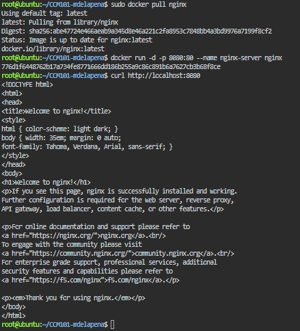
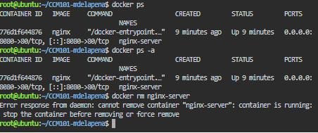

# Laboratory Activity 4: Mission 4 – The Cloud-Native Engineer

## Mission Overview

This laboratory activity focuses on the shift from traditional Virtual Machines to containerization. Using the KillerCoda Playground and Docker, an Nginx web server is pulled, deployed, tested, stopped, and removed. The activity also develops practical skills in Docker CLI operations, Markdown documentation, screenshots, and GitHub portfolio management.

## Objectives

- Differentiate between traditional Virtual Machines and Containers.
- Access a Docker-enabled cloud environment using KillerCoda.
- Execute fundamental Docker CLI commands.
- Pull, run, manage, and terminate an Nginx container.
- Document container operations using Markdown.
- Continue developing a well-organized GitHub Cloud Computing Portfolio.

## Docker Commands Executed

```bash
docker --version
docker info
docker pull nginx
docker run -d -p 8080:80 --name nginx-server nginx
docker ps
curl http://localhost:8080
docker stop nginx-server
docker ps -a
docker rm nginx-server
```

## Skills Learned

- Docker CLI fundamentals
- Container deployment
- Nginx web-server deployment
- Port mapping
- Container lifecycle management
- Linux terminal operations
- Markdown technical documentation
- GitHub portfolio organization

## Challenges Encountered

One challenge was understanding the difference between a Virtual Machine and a container. Another was understanding how host and container ports are connected through port mapping. Running Nginx and checking it with `curl` helped demonstrate how a service can be deployed quickly inside a container.



### Container Lifecycle


